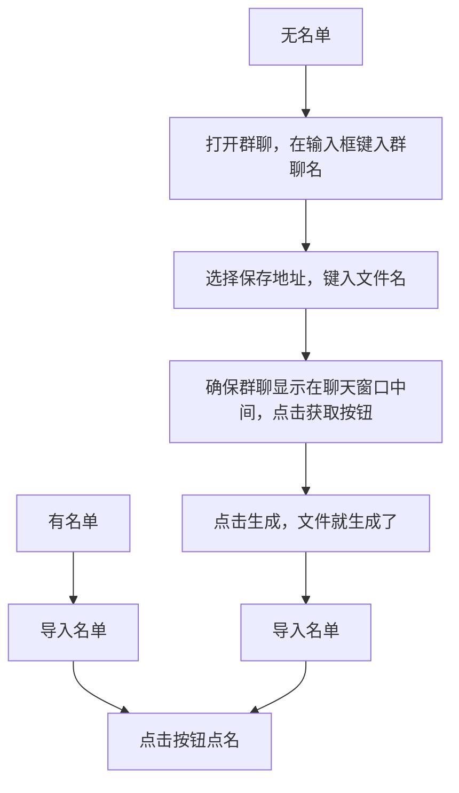

# 导入导出群名单的点名exe(csv文件，某聊天软件电脑端3.9.12.51,最新版本已经失效，此代码留着纪念吧)

> 在公司面对引流到私域，用户不愿意二次扫码，我想到了可以用直播抽奖的方法来改善，那么搞一个点名程序吧。面对私域客户名单录入，如果是几百个名单呢？一个个打字实在太繁琐了，所以大专毕业两年没碰过代码的我，重新的看了几个视频，在无头绪的情况下想到了uiautonmation自动化这个库，在下班时间大概花了3天时间，这个软件自己搞出来了。过程痛苦，但成就感满满。毕竟大专玩了三年，毛都不知道。不过在我兴致勃勃的将成果在会议上拿出，老板说他感觉不如微信红包里挑手气王，所以很可惜没有用上，过不了多久我就被开了。是的在温州2000块钱工资的新媒体运营，负责视频编剧素材收集和剪辑加发布的我，就这么被开了，老板给我扣了个帽子说我“工作不积极”，对此我表生异议，我敲我休息的时候都在帮他日更，帮他把账号从0开始搞到每条视频1000播放量打底，最高2w播放，他流是不投的，流量是想要的。

> 我面对的情况是，钱是没有的，剪映会员是自费的，电脑是自带的，私人社交账号是上交公司的，公司给我私人账号弄封号是没有道歉的，也是得寸进尺的，没有一句抱歉，只有两句话，“大不了再注册一个”，“既然绑定你支付宝账号建议的话，那算了”。老板开除我时说：“接下来面试别人你也别介意，你就等着交接就行，钱别担心，干多少天就多少天的工资”，我说“行”，回到办公区，说是办公区也只是居民房罢了。在桌子上发呆，思考良久，我选择辞职，他让我等交接只是不想让账号断更罢了，我选择没有扯皮，让他结账，800多12天真是一笔巨款啊.我拿起了钥匙.看他懊恼着坐在位置上，我关上房门乘坐电梯。离开了小区。骑上了自行车，这自行车的前刹坏了，把手被摔断了，当然还是借给公司高管干的喽，真的很难以置信，24岁的人连个自行车都不会停，导致我的刹车把手直接断了。接下来就是漫长的找工作了，以及温州客服都需要有经验，我也是无能为力了。

## 适用人群
  大概是老师这些人群,建议进群时每位同学都改成自己的真名。

# 如何使用

> 混成这样真的没脸见人，样样不通，希望看到的同学引以为戒。
